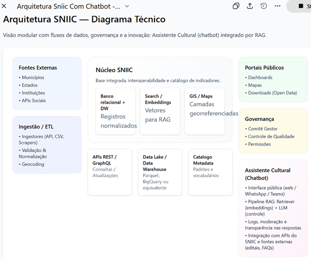

# SNIIC 2.0 — Arquitetura Completa com Assistente Cultural (IA + RAG)
 O **SNIIC 2.0 (Sistema Nacional de Informações e Indicadores Culturais)** é uma reconstrução moderna da plataforma nacional de dados culturais, unificando registros, indicadores, metadados e fontes federativas em uma arquitetura escalável, padronizada e interoperável.

Além da reativação dos fluxos de ingestão, limpeza e governança de dados, esta proposta inclui uma inovação estratégica: o **Assistente Cultural Nacional**, um chatbot baseado em IA que utiliza técnicas de RAG (Retrieval-Augmented Generation) para responder perguntas do cidadão diretamente a partir da base integrada.

Semana 1-4:   Fundação (DB, Modelagem, Setup)
Semana 5-8:   ETL Pipeline (Ingestão + Embeddings)
Semana 9-12:  RAG Core (Vector Search + SQL Agent + Router)
Semana 13-16: API + Frontend MVP
Semana 17-20: Otimização + Testes + Métricas
Semana 21-22: Deploy Staging
Semana 23-24: Testes com usuários piloto
Semana 25:    Deploy Produção (Soft Launch)

**Total: ~6 meses para MVP robusto**

---

## POSTGRESQL

### ✅ **RECOMENDAÇÃO: Começar com PostgreSQL + pgvector**

**Razões:**

1. **Simplicidade**: Uma única base de dados = menos complexidade operacional
2. **Busca Híbrida Native**: Filtros SQL + vetorial na mesma query
3. **Custo**: Sem serviço adicional pago
4. **Governança**: Dados centralizados, auditoria simplificada
5. **Time-to-Market**: Setup mais rápido

### 🔄 **Quando Migrar para Banco Vetorial Dedicado:**

**Gatilhos de Migração:**

- [ ] Volume > 50 milhões de documentos
- [ ] Latência média > 2 segundos (consistente)
- [ ] Throughput > 10k queries/segundo
- [ ] Necessidade de escalabilidade horizontal agressiva
- [ ] Budget disponível para DevOps especializado

**Migração Gradual:**
PostgreSQL → Hybrid (Postgres + Qdrant) → Full Vector DB

Manter dados estruturados no Postgres e migrar apenas vetores para Qdrant/Milvus.

---

### Semana 1 - Action Items:

1. [ ] **Definir ambiente de desenvolvimento**
   - Cloud provider (AWS/GCP/Azure)
   - Provisionar PostgreSQL
   - Configurar repositório Git

2. [ ] **Inventariar fontes de dados**
   - Listar todos PDFs, planilhas, APIs
   - Documentar estrutura de cada fonte
   - Definir prioridades de ingestão

3. [ ] **Configurar API do Gemini**
   - Obter API key
   - Testar chamadas básicas
   - Definir rate limits

4. [ ] **Montar equipe/papéis**
   - Engenheiro de Dados (ETL)
   - Desenvolvedor Backend (API)
   - Desenvolvedor Frontend (se necessário)
   - Data Scientist (métricas/avaliação)

5. [ ] **Definir casos de uso prioritários**
   - Top 10 perguntas que o sistema deve responder
   - Criar ground truth para essas perguntas
   - Usar como benchmark de sucesso

---

O projeto SNIIC 2.0 é ambicioso mas absolutamente viável com a stack recomendada. A escolha de **PostgreSQL + pgvector** como base unificada oferece:

✅ Menor complexidade operacional  
✅ Busca híbrida poderosa (crucial para dados governamentais)  
✅ Custo controlado  
✅ Governança simplificada  
✅ Time-to-market mais rápido  

O Agentic RAG com Router + Vector Search + SQL Agent permitirá responder tanto perguntas conceituais (leis, regras) quanto analíticas (valores, estatísticas), tornando o assistente verdadeiramente útil para cidadãos e gestores.

**Sucesso do projeto dependerá de:**
1. Qualidade da engenharia de dados (ETL robusto)
2. Curadoria dos metadados (classificações corretas)
3. System prompts bem elaborados (comportamento do LLM)
4. Avaliação contínua (métricas de qualidade)

---

.......FALTA !...... (LQMC)

Linhagem de Dados (Data Lineage):
Origem de cada dado: de quais sistemas ou bases ele vem.

Transformações aplicadas: 
quais ETLs, regras de negócio ou pipelines foram aplicados.

Destino dos dados: 
quais dashboards, relatórios ou repositórios consomem esses dados.

Qualidade de Dados (Data Quality):
Métricas de completude, consistência e precisão.
Alertas de inconsistências ou duplicidades.

Metadados:
Descrição, dono do dado, sensibilidade e classificação.

Catálogo de Dados (Data Catalog):
Um repositório central de metadados e linhagem para descoberta e auditoria.

Controle de versões e histórico:
Histórico de alterações, quem alterou e quando, para auditabilidade.

## Objetivos Principais

* **Centralizar** dados culturais municipais, estaduais e federais.
* **Padronizar** registros, vocabulários e metadados culturais.
* **Transparência pública** via dashboards, mapas e APIs abertas.
* **Governança sólida**: validação, auditoria e controle de qualidade.
* **Inovação**: criação de um **assistente inteligente** capaz de responder perguntas sobre cultura em linguagem natural.

---

## Arquitetura Geral

A arquitetura é composta por cinco camadas principais:

### 1. **Fontes de Dados (Nacional + Federativo)**

* Municípios
* Estados
* Instituições culturais
* Sistemas e APIs públicas
* Bases de editais, equipamentos, agentes e projetos culturais

### 2. **Ingestão e ETL**

Pipeline automatizado com:

* Coleta (API/CSV/Web Scraping)
* Validação e deduplicação
* Padronização (vocabulários e códigos internos)
* Geocodificação

### 3. **Núcleo SNIIC (Base Integrada)**

* Banco relacional + Data Warehouse
* Metadata Catalog com padrões nacionais
* Data Lake em formato aberto (Parquet/CSV)
* Módulos de GIS e cartografia
* Índices semânticos para IA (embeddings)

### 4. **APIs (REST/GraphQL)**

Fornecem:

* Consulta pública de dados
* Endpoints analíticos
* Exportações abertas (Open Data)

### 5. **Consumo e Aplicações**

* Dashboards oficiais
* Mapas culturais
* Portais públicos
* Aplicações externas

---

## Assistente Cultural Nacional (IA + RAG)

Proposta de inovação integrada ao SNIIC 2.0.

### Funcionalidades

* Respostas em linguagem natural sobre:

  * equipamentos culturais
  * editais vigentes
  * indicadores
  * políticas públicas
  * eventos e cadastros
* Consulta semântica via RAG
* Transparência: links para fontes originais
* Modo explicativo para gestores
* Modo cidadão para dúvidas gerais

### Arquitetura do Assistente

* **Vector Store**: base de embeddings gerada a partir dos registros do SNIIC
* **Retriever**: busca semântica
* **LLM**: modelo regulado com instruções do MinC
* **Pipeline RAG**: contexto + resposta fundamentada
* **Integração** via API com camadas do SNIIC

---

## Fluxo de Dados (Resumido)

1. Fontes municipais/estaduais → Ingestão/ETL
2. ETL → Base Integrada + Metadata
3. Base Integrada → APIs públicas
4. APIs → Dashboards, mapas, portais
5. APIs + Índices semânticos → Assistente Cultural (RAG + LLM)

---

## Tecnologias Sugeridas

* **Ingestão/ETL**: Python, Airflow, dbt
* **Armazenamento**: PostgreSQL, BigQuery, Parquet
* **APIs**: FastAPI / GraphQL
* **Dashboards**: Superset / Metabase
* **GIS**: PostGIS, GeoServer
* **IA/RAG**: LangChain, FAISS/Chroma, OpenAI/Claude
* **Frontend**: React / Next.js

---

## Benefícios Diretos

* Modernização completa do ecossistema de dados culturais.
* Redução de carga manual para equipes internas.
* Aumento da transparência e acesso à informação.
* Ferramenta inédita para o cidadão: **um Chatbot Cultural Nacional**.
* Fundação robusta para novos indicadores e análises.

---

## Checklist Extração:

 Implementar extração de PDFs
 Implementar extração de Excel/CSV
 Implementar extração de Word (.docx)
 Implementar consumo de APIs externas
 Adicionar tratamento de erros e logs
 Criar testes unitários para cada ingressor

## Processamento e Limpeza

 Normalização de Texto
 Remover caracteres especiais
 Normalizar espaços e quebras de linha
 Corrigir encoding (UTF-8)
 Identificar e preservar estruturas (tabelas, listas)
 Extração de Metadados
 Extrair datas de documentos
 Identificar tipo de documento (regex patterns)
 Extrair referências legais (Lei X/YYYY)
 Identificar localização geográfica
 Validação de Qualidade
 Chunks muito pequenos (< 100 chars) → descartar ou mesclar
 Detecção de chunks duplicados
 Verificação de encoding corrompido

## Checklist Embeddings:

 Escolher modelo de embedding
 Testar qualidade em português jurídico
 Benchmark de velocidade
 Definir dimensão do vetor (768 vs 1024)
 Implementar geração em batch (eficiência)
 Adicionar cache de embeddings (evitar reprocessamento)
 Implementar retry logic para falhas
 Monitorar uso de memória

 ## Checklist Carregamento:

 Implementar bulk insert (não um por um!)
 Adicionar detecção de duplicatas (hash)
 Implementar upsert logic
 Adicionar transações (rollback em erro)
 Logging detalhado de cada carga
 Métricas: tempo de carga, registros inseridos/falhados

 ## Checklist Busca Vetorial:

 Implementar busca básica por similaridade
 Adicionar filtros de metadados (tipo, UF, área)
 Implementar busca híbrida (Sparse + Dense)
 Adicionar threshold de similaridade mínima
 Implementar cache de queries frequentes
 Logging de todas as buscas (analytics)

 ## Checklist SQL Agent:

 Configurar LLM (Gemini 1.5 Flash recomendado)
 Criar system prompt robusto com:
 Exemplos few-shot (vocabulário MinC)
 Regras de segurança (READ-ONLY)
 Mapeamento de termos leigos → colunas SQL
 Implementar sanitização de queries
 Adicionar retry logic (3 tentativas)
 Implementar self-correction (se SQL falhar)
 Logging de todas queries geradas
 Testes com perguntas complexas

 ## Checklist Router:

 Implementar classificação de intenção
 Testar com 100+ perguntas variadas
 Adicionar fallback (se incerto, usar ambas)
 Implementar chain-of-thought reasoning
 Logging de todas decisões de roteamento
 Métricas: taxa de acerto do router

 ## Checklist Reranker:

 Escolher modelo de reranking
 Integrar após busca vetorial inicial
 Benchmark: comparar relevância com/sem reranker
 Otimizar threshold de reranking score
 Monitorar impacto na latência

 
## Licença

MIT (pode ser ajustada conforme orientação do MinC).

---

## Contato

Coordenação-Geral de Informações e Indicadores Culturais (CGIIC)
Ministério da Cultura

